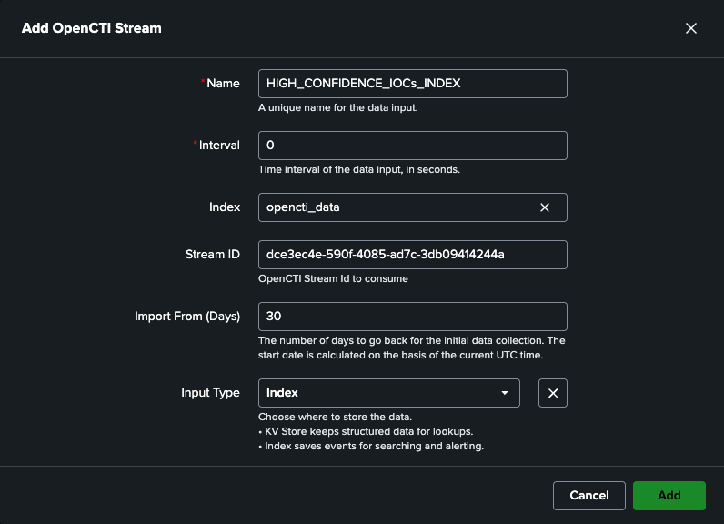

# TA-opencti-for-splunk-enterprise

**Version 1.0.0**  
**Author:** Filigran

---


## Overview

The **OpenCTI for Splunk Enterprise Add-on** provides a modular framework for integrating threat intelligence from [OpenCTI](https://filigran.io/platforms/opencti/) into Splunk.  
It enables analysts to collect, normalize, and enrich OpenCTI indicators and observables, making them searchable within Splunk Enterprise for correlation, detection, and incident response.

---

## Key Features

- Modular inputs for ingesting OpenCTI data via the OpenCTI Stream API.
- Support for multiple object types (Indicators, Observables, Relationships, Sightings).
- Pre-configured eventtypes, tags, and alert actions.
- Custom REST endpoints for configuration and health-checks.
- Automatic reload triggers for modular input changes.

---

## Installation

### Installation from Splunkbase

1. Log in to the Splunk Web UI and navigate to "Apps" and click on "Find more Apps"
2. Search for "OpenCTI for Splunk Enterprise Add-on"
3. Click Install
   The app is installed

### Installing from file through the UI

1. Download latest version of the Splunk App: [TA-opencti-for-splunk-enterprise-1.0.0.tar.gz](https://github.com/OpenCTI-Platform/splunk-enterprise-add-on/releases/download/1.0.0/TA-opencti-for-splunk-enterprise-1.0.0.tar.gz)
2. Log in to the Splunk Web UI and navigate to "Apps" and click on "Manage Apps"
3. Click "Install app from file"
4. Choose file and select the "TA-opencti-for-splunk-enterprise-1.0.0.tar.gz" file
5. Click on Upload
   The app is installed

---

## General Configuration

### OpenCTI user account

Before configuring the App, we strongly recommend that you create a dedicated account in OpenCTI with the same properties as for a connector service account.
To create this service account, please refer to [Create a Service Account](https://docs.opencti.io/latest/administration/users/?h=service+account#create-a-service-account) documentation.

### General Add-On settings

1. Navigate to Splunk Web UI home page, open the "OpenCTI for Splunk Enterprise Add-on" and navigate to "Configuration" page.
2. Click on "Account" tab and complete the form with the required settings:

| Parameter                  | Description                                                      |
|----------------------------|------------------------------------------------------------------|
| `OpenCTI URL`              | The URL of the OpenCTI platform (A HTTPS connection is required) |
| `OpenCTI API Key`          | The API Token of the previously created user                     |


Configuration parameters are stored securely in `local/passwords.conf`.  
Never ship credentials in `default/passwords.conf`.

If a proxy configuration is required to connect to OpenCTI platform, you can configure it on the Proxy page

| Parameter        | Description                                                                 |
|------------------|-----------------------------------------------------------------------------|
| `Enable Proxy`   | Determines whether a proxy is required to communicate with OpenCTI platform |
| `Proxy Type`     | The type of proxy to use                                                    |
| `Proxy Host`     | The proxy hostname or IP address                                            |
| `Proxy Port`     | The proxy port                                                              |
| `Proxy Username` | An optional proxy username                                                  |
| `Proxy Password` | An optional proxy password                                                  |

## OpenCTI Data Inputs Configuration

The "OpenCTI for Splunk Enterprise Add-on" enables Splunk to be feed with intelligence exposed through an OpenCTI live stream. 
To do this, the add-on implements and manages Splunk modular inputs.

When configuring a modular input, you have two options for storing intelligence data:
- Write directly to dedicated KV Store collections defined by the application
- Write to a Splunk index, which will then propagate the data to a KV Store using saved searches


### KV Store Data Inputs configuration

Proceed as follows to enable the ingestion of data in pre-defined KV Store:

1. From the "OpenCTI for Splunk Enterprise Add-on" sub menus, select the "Inputs" sub menu.
2. Click on "Create new input" button.
3. Complete the form with the following settings:

| Parameter     | Description                                                                                                    |
|---------------|----------------------------------------------------------------------------------------------------------------|
| `Name`        | Unique name for the input being configured                                                                     |
| `Interval`    | Time interval of input in seconds. Leave as default (0) to allow continuous execution of the ingestion process |
| `Index`       | Leave empty. Not applicable when writing directly to KV Store                                                  |
| `Stream Id`   | The Live Stream ID of the OpenCTI stream to consume                                                            |
| `Import from` | The number of days to go back for the initial data collection (default: 30) (optional)                         |
| `Input Type`  | Select KV Store entry                                                                                          |

4. Once the Input parameters have been correctly configured click "Add".


5. Validate the newly created Input and ensure it's set to "Enabled".

As soon as the input is created, the ingestion of data begins.

Here are the KV Store names used to store intelligence: 
- opencti_indicators: store STIX indicators and related context information (related threat actors, vulnerabilities, malware, attack patterns...)
- opencti_reports: store STIX reports
- opencti_markings: store STIX markings definitions
- opencti_identities: store STIX identities definitions

You can monitor the import of indicators using the following Splunk SPL query that list all indicators ingested in the 'opencti_indicators' KV Store:

```
| inputlookup opencti_indicators
```

You can also consult the "Monitoring Dashboard" which gives you an overview of indicators ingested in the 'opencti_indicators' KV Store.


The ingestion process can also be monitored by consulting the log file ```ta-opencti-for-splunk-enterprise_{DATA_INPUT_NAME}.log``` present in the directory ```$SPLUNK_HOME/var/log/splunk/```

### Index Data Inputs configuration

Proceed as follows to enable the ingestion of data in a Splunk index.

1. From the "OpenCTI for Splunk Enterprise Add-on" sub menus, select the "Inputs" sub menu.
2. Click on "Create new input" button.
3. Complete the form with the following settings:

| Parameter     | Description                                                                                                    |
|---------------|----------------------------------------------------------------------------------------------------------------|
| `Name`        | Unique name for the input being configured                                                                     |
| `Interval`    | Time interval of input in seconds. Leave as default (0) to allow continuous execution of the ingestion process |
| `Index`       | Select the Splunk Index to feed                                                                                |
| `Stream Id`   | The Live Stream ID of the OpenCTI stream to consume                                                            |
| `Import from` | The number of days to go back for the initial data collection (default: 30) (optional)                         |
| `Input Type`  | Select Index entry                                                                                             |

4. Once the Input parameters have been correctly configured click "Add".



5. Validate the newly created Input and ensure it's set to "Enabled".

As soon as the input is created, the ingestion of data begins.

You can monitor the import of indicators using the following Splunk SPL query that list all data ingested in the selected Index.

```
index="opencti_data" source="opencti" sourcetype="opencti:indicator"
```

## Index-Based Ingestion Configuration (Required for Saved Searches)

When using **Index mode** ingestion, OpenCTI data is first written to a Splunk index and then synchronized into KV Store collections via saved searches.  
This section explains **how to define the index**, **configure macros**, and **enable the required saved searches**.

---

## 1. Choose or Create a Splunk Index

By default, the add-on **does not assume a fixed index name**.

### Recommended default index
```
opencti_data
```
### Create a dedicated index (recommended)

In Splunk Web:

1. Go to **Settings ▸ Indexes**
2. Click **New Index**
3. Set:
   - **Index name:** `opencti_data`
   - Leave other settings at defaults (or align with your data retention policy)
4. Save

> ⚠️ If you choose a **custom index name**, you must update the OpenCTI macro configuration (see below).

---

## 2. Configure the OpenCTI Modular Input (Index Mode)

When creating a modular input:

| Field          | Value |
|----------------|-------|
| **Input Type** | `Index entry` |
| **Index**      | `opencti_data` (or your custom index) |
| **Stream ID**  | OpenCTI Live Stream ID |
| **Interval**   | `0` (continuous) |

Once enabled:
- Each **OpenCTI stream event** is written as a **Splunk event**
- Events are **append-only**
- The same indicator may appear multiple times as it evolves over time

### Event metadata

| Field | Value |
|------|------|
| `source` | `opencti` |
| `sourcetype` | `opencti:indicator`, `opencti:report`, etc. |

---

## 3. Configure the OpenCTI Index Macro (Required)

All shipped saved searches rely on a macro to locate OpenCTI data.

### Macro name

```
opencti_index
```

### Default definition

```
index=opencti_data
```

### How to configure

1. Go to **Settings ▸ Advanced Search ▸ Search macros**
2. Locate `opencti_index`
3. Edit the macro definition:
```
index=<YOUR_INDEX_NAME>
```
4. Save

> ⚠️ If this macro is not updated correctly:
> - Saved searches will return **zero results**
> - KV Store synchronization will silently fail

---

## 4. Enable Required Saved Searches (Index → KV Store Sync)

Index mode relies on scheduled searches to populate KV Store collections.

### Required saved searches

| Saved Search Name | Purpose |
|------------------|--------|
| `Update OpenCTI Indicators Lookup` | Sync indicators into `opencti_indicators` KV Store |
| `Update OpenCTI Reports Lookup` | Sync reports into `opencti_reports` |
| `Nightly Rebuild OpenCTI Indicators Lookup` | Full rebuild safety net |

### Enable them

1. Go to **Settings ▸ Searches, reports, and alerts**
2. Set **App context** to `TA-opencti-for-splunk-enterprise`
3. Enable:
- `Update OpenCTI Indicators Lookup`
- `Update OpenCTI Reports Lookup`
4. Verify schedules are enabled (default is sufficient)

---

## 5. Data Flow Summary (Index Mode)
```
OpenCTI Stream
↓
Splunk Index (opencti_data)
↓
Saved Searches
↓
KV Store Collections
↓
Dashboards / Alert Actions
```
---

## 6. Common Failure Modes (and How to Avoid Them)

| Issue | Cause | Fix |
|-----|------|-----|
| No indicators in dashboards | Macro points to wrong index | Update `opencti_index` |
| KV Stores empty | Saved searches disabled | Enable saved searches |
| Duplicate indicators | Expected behavior | Events are versioned |

---

## 7. Verification Checklist

Run these searches to confirm everything is working:

### Index ingestion
```
`opencti_index`
| stats count by sourcetype
```

### KV Store population

```
| inputlookup opencti_indicators
| head 10
```
