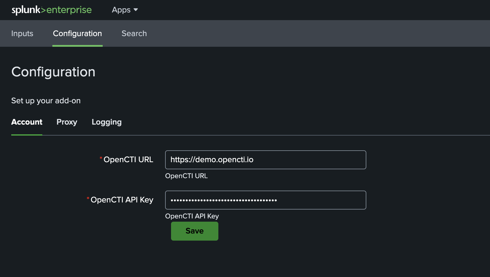
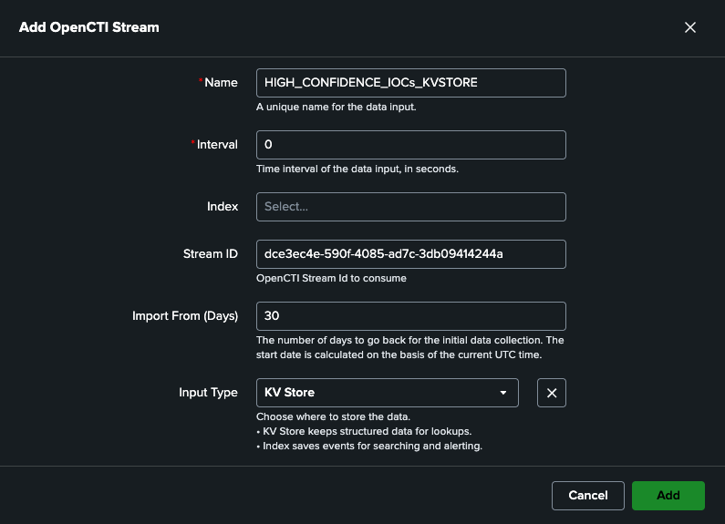
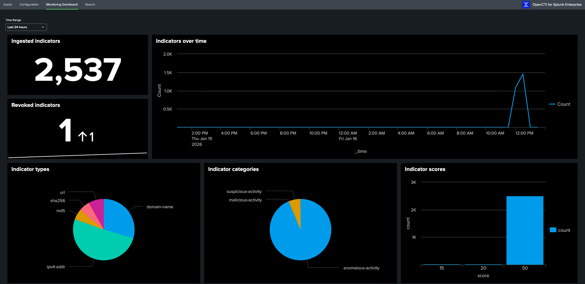

# TA-opencti-for-splunk-enterprise

**Version 1.0.0**  
**Author:** Filigran

---


## Overview

The **OpenCTI for Splunk Enterprise Add-on** provides a modular framework for integrating threat intelligence from [OpenCTI](https://filigran.io/platforms/opencti/) into Splunk.  
It enables analysts to collect, normalize, and enrich OpenCTI indicators and observables, making them searchable within Splunk Enterprise for correlation, detection, and incident response.

---

## Key Features

- Modular inputs for ingesting OpenCTI data via the OpenCTI Stream API.
- Support for multiple object types (Indicators, Observables, Relationships, Sightings).
- Pre-configured eventtypes, tags, and alert actions.
- Custom REST endpoints for configuration and health-checks.
- Automatic reload triggers for modular input changes.

---

## Installation

### Installation from Splunkbase

1. Log in to the Splunk Web UI and navigate to "Apps" and click on "Find more Apps"
2. Search for "OpenCTI for Splunk Enterprise Add-on"
3. Click Install
   The app is installed

### Installing from file through the UI

1. Download latest version of the Splunk App: [TA-opencti-for-splunk-enterprise-1.0.0.tar.gz](https://github.com/OpenCTI-Platform/splunk-enterprise-add-on/releases/download/1.0.0/TA-opencti-for-splunk-enterprise-1.0.0.tar.gz)
2. Log in to the Splunk Web UI and navigate to "Apps" and click on "Manage Apps"
3. Click "Install app from file"
4. Choose file and select the "TA-opencti-for-splunk-enterprise-1.0.0.tar.gz" file
5. Click on Upload
   The app is installed

---

## General Configuration

### OpenCTI user account

Before configuring the App, we strongly recommend that you create a dedicated account in OpenCTI with the same properties as for a connector service account.
To create this service account, please refer to [Create a Service Account](https://docs.opencti.io/latest/administration/users/?h=service+account#create-a-service-account) documentation.

### General Add-On settings

1. Navigate to Splunk Web UI home page, open the "OpenCTI for Splunk Enterprise Add-on" and navigate to "Configuration" page.
2. Click on "Account" tab and complete the form with the required settings:

| Parameter                  | Description                                                      |
|----------------------------|------------------------------------------------------------------|
| `OpenCTI URL`              | The URL of the OpenCTI platform (A HTTPS connection is required) |
| `OpenCTI API Key`          | The API Token of the previously created user                     |



Configuration parameters are stored securely in `local/passwords.conf`.  
Never ship credentials in `default/passwords.conf`.

If a proxy configuration is required to connect to OpenCTI platform, you can configure it on the Proxy page

| Parameter        | Description                                                                 |
|------------------|-----------------------------------------------------------------------------|
| `Enable Proxy`   | Determines whether a proxy is required to communicate with OpenCTI platform |
| `Proxy Type`     | The type of proxy to use                                                    |
| `Proxy Host`     | The proxy hostname or IP address                                            |
| `Proxy Port`     | The proxy port                                                              |
| `Proxy Username` | An optional proxy username                                                  |
| `Proxy Password` | An optional proxy password                                                  |

## OpenCTI Data Inputs Configuration

The "OpenCTI for Splunk Enterprise Add-on" enables Splunk to be feed with intelligence exposed through an OpenCTI live stream. 
To do this, the add-on implements and manages Splunk modular inputs.

When configuring a modular input, you have two options for storing intelligence data:
- Write directly to dedicated KV Store collections defined by the application
- Write to a Splunk index, which will then propagate the data to a KV Store using saved searches


### KV Store Data Inputs configuration

Proceed as follows to enable the ingestion of data:

1. From the "OpenCTI for Splunk Enterprise Add-on" sub menus, select the "Inputs" sub menu.
2. Click on "Create new input" button.
3. Complete the form with the following settings:

| Parameter     | Description                                                                                                    |
|---------------|----------------------------------------------------------------------------------------------------------------|
| `Name`        | Unique name for the input being configured                                                                     |
| `Interval`    | Time interval of input in seconds. Leave as default (0) to allow continuous execution of the ingestion process |
| `Index`       | Leave empty. Not applicable when writing directly to KV Store                                                  |
| `Stream Id`   | The Live Stream ID of the OpenCTI stream to consume                                                            |
| `Import from` | The number of days to go back for the initial data collection (default: 30) (optional)                         |
| `Input Type`  | Select KV Store entry                                                                                          |

4. Once the Input parameters have been correctly configured click "Add".



5. Validate the newly created Input and ensure it's set to "Enabled".

As soon as the input is created, the ingestion of data begins.

Here are the KV Store names used to store intelligence: 
- opencti_indicators: store STIX indicators and related context information (related threat actors, vulnerabilities, malware, attack patterns...)
- opencti_reports: store STIX reports
- opencti_markings: store STIX markings definitions
- opencti_identities: store STIX identities definitions

You can monitor the import of indicators using the following Splunk SPL query that list all indicators ingested in the 'opencti_indicators' KV Store:

```
| inputlookup opencti_indicators
```

You can also consult the "Monitoring Dashboard" which gives you an overview of indicators ingested in the 'opencti_indicators' KV Store.



The ingestion process can also be monitored by consulting the log file ```ta-opencti-for-splunk-enterprise_{DATA_INPUT_NAME}.log``` present in the directory ```$SPLUNK_HOME/var/log/splunk/```


### Splunk Index Data Inputs configuration

Indicators are stored in a dedicated kvstore named “opencti_indicators”.
A default lookup definition named "opencti_lookup" is also implemented to facilitate indicator management.

## Configuration

| Setting                   | Description                                             |
|---------------------------| ------------------------------------------------------- |
| **API URL**               | Base URL of your OpenCTI instance.                      |
| **API Token**             | Access token used for authentication.                   |
| **Collection Interval**   | Frequency (in seconds) at which data is collected.      |
| **Object Types**          | Comma-separated list of OpenCTI entity types to ingest. |


---

## Index Configuration

If you plan to store OpenCTI data in a dedicated index, define one manually.

### For on-prem installs

Create the following stanza in `default/indexes.conf` or your deployment tooling:

```ini
[opencti]
homePath   = $SPLUNK_DB/opencti/db
coldPath   = $SPLUNK_DB/opencti/colddb
thawedPath = $SPLUNK_DB/opencti/thaweddb
# frozenTimePeriodInSecs = 15552000   # optional retention (180 days)
```

---

## Splunk Enterprise Security Integration

The add-on can expose OpenCTI indicators to the Splunk Enterprise Security (ES) Threat Intelligence Framework by populating an ES-compliant lookup called `opencti_threatintel`.

At a high level:

1. The modular input writes OpenCTI events into a Splunk index (for example, `opencti_stream`).
2. Normalization searches populate a catalog of indicators in the `opencti_indicators` KV store.
3. A scheduled search maps `opencti_indicators` into an ES-friendly lookup named `opencti_threatintel`.
4. ES is configured to treat `opencti_threatintel` as a threat intelligence source.

> **Note:** The `opencti_threatintel` lookup can be defined either in this add-on **or** in the ES app (`SA-ThreatIntelligence`).  
> A saved search running in the OpenCTI app can populate it as long as:
>
> - The lookup definition is shared **Global**, and
> - There is no other lookup with the same name shadowing it in the OpenCTI app.

### Prerquisites

- Splunk Enterprise Security installed on the search head where this add-on is installed.
- The OpenCTI modular input is configured and successfully ingesting data.
- The `opencti_indicators` KV store lookup is populated
- You have admin (or equivalent) permissions in Splunk and ES.

### 1. Create the `opencti_threatintel` KV Store lookup

1. In Splunk Web, go to **Settings ▸ Lookups ▸ Lookup definitions**.
2. Click **Add new** and create a KV Store lookup:
    - **Destination app:** `SA-ThreatIntelligence`
    - **Name:** `opencti_threatintel`
    - **Type:** KV Store
    - **KV store collection name:** `opencti_threatintel`
    - **Fields:** \_key, threat_key, threat_match_value, threat_type, threat_description, threat_group, threat_category, threat_first_seen, threat_last_seen, threat_confidence, threat_weight
3. After saving, click on the **Permissions** link for the `opencti_threatintel` lookup definition:
    - Set **Sharing** to **Global** so ES (in apps like `TA-opencti-for-splunk-enterprise`) can read it.

> If you prefer to manage collections via config files, you can instead define this collection in `collections.conf` and the lookup in `transforms.conf`.

---

### 2. Verify the `opencti_indicators` lookup

The shipped searches in this add-on maintain a canonical indicator lookup in the `opencti_indicators` KV store. ES integration builds on top of this lookup.

To verify it has data:

1. Open **Search & Reporting**.
2. Run:

   ```spl
   | inputlookup opencti_indicators
   | head 10
   ```

3. You should see one row per OpenCTI indicator, with fields such as id, name, pattern, value, score, confidence, main_observable_type, etc.

If this lookup is empty, review your OpenCTI inputs and the “Update OpenCTI Indicators Lookup” / “Nightly Rebuild OpenCTI Indicators Lookup” saved searches before proceeding.

---

### 3. Enable the Update Enterprise Security Threat Intelligence saved search

The OpenCTI add-on ships with a saved search called `Update Enterprise Security Threat Intelligence` that transforms the opencti_indicators catalog into the ES Threat Intelligence schema and writes it into the opencti_threatintel KV Store lookup.

Saved search properties (default):

- **Name:** `Update Enterprise Security Threat Intelligence`
- **App context:** TA-opencti-for-splunk-enterprise
- **Schedule:** _/5 _ \* \* \* (every 5 minutes)
- **Core SPL (conceptual):**

    - Reads from opencti_indicators via | inputlookup opencti_indicators
    - Maps OpenCTI fields into ES fields:

| ES field             | Source OpenCTI field(s)                                   | Notes                                                                                                 |
| -------------------- | --------------------------------------------------------- | ----------------------------------------------------------------------------------------------------- |
| `threat_key`         | `id`                                                      | Stable identifier for the indicator (OpenCTI ID).                                                     |
| `threat_match_value` | `value`                                                   | Actual indicator value (IP, domain, URL, hash, email, etc.).                                          |
| `threat_type`        | `main_observable_type`, `type`                            | Mapped to ES types such as `ip_intel`, `domain_intel`, `url_intel`, `file_intel`, `email_intel`, etc. |
| `threat_description` | `name`                                                    | Human-readable name/title of the indicator.                                                           |
| `threat_group`       | `created_by`                                              | Origin or owner of the indicator (e.g., group, organization, actor).                                  |
| `threat_category`    | `labels`, `attack_patterns`, `malware`, `vulnerabilities` | Combined, multi-valued category/tactic/context information.                                           |
| `threat_first_seen`  | `valid_from`, `created`, `created_at`                     | First time the indicator was observed or became valid.                                                |
| `threat_last_seen`   | `valid_until`, `modified`, `updated_at`                   | Last time the indicator was observed or considered valid.                                             |
| `threat_confidence`  | `confidence`                                              | Numeric or ordinal confidence score from OpenCTI.                                                     |
| `threat_weight`      | `score`                                                   | Severity/priority score used by ES for weighting during correlation.                                  |

To verify or adjust this saved search:

1. In Splunk Web, go to **Settings ▸ Searches, reports, and alerts**.
2. Set App to TA-opencti-for-splunk-enterprise.
3. Locate `Update Enterprise Security Threat Intelligence`
4. Open the search:
    - Confirm it begins with | inputlookup opencti_indicators.
    - Confirm it ends with | outputlookup opencti_threatintel.
5. On the Schedule tab:
    - Ensure the search is enabled.
    - Adjust the schedule if needed (for example, to run less or more frequently based on your OpenCTI update cadence). 6. Save your changes.

On each run, this search rebuilds the ES Threat Intelligence KV from the enriched opencti_indicators KV.

---

### 4. Validate that opencti_threatintel is being populated

After the `Update Enterprise Security Threat Intelligence` search has run at least once:

1. Go to **Settings ▸ Lookups ▸ KV Store lookups**
2. Click Lookup contents for opencti_threatintel.
3. You should see rows of indicators with ES threat fields populated.

Or from search:

```
| inputlookup opencti_threatintel
| head 20
```

If you see no results:

- Confirm the saved search `Update Enterprise Security Threat Intelligence` has run successfully (check Activity ▸ Jobs).
- Confirm opencti_indicators contains data.
- Check lookup permissions:
- opencti_indicators and opencti_threatintel must both be shared Global and readable by ES.

---

### 5. Register opencti_threatintel as a Threat Intelligence source in ES

Once opencti_threatintel contains data, register it as a threat intelligence source:

1. In Splunk Enterprise Security, go to
   **Configure ▸ Data Enrichment ▸ Threat Intelligence Management** (menu name may vary slightly by ES version).
2. Under Threat Intelligence Sources, add a new source:
   **Type:** KV Store
   **Name:** OpenCTI Threat Intelligence (or any clear label)
   **Collection / Lookup:** `opencti_threatintel`
3. Enable the source.
4. Confirm that field mappings align with your lookup structure:
   **Indicator value** → threat_match_value
   **Type** → threat_type
   **Description / group / category** → threat_description, threat_group, threat_category
   **Temporal / scoring fields** → threat_first_seen, threat_last_seen, threat_confidence, threat_weight

At this point, ES correlation searches and threat intel–aware dashboards can use opencti_threatintel as a live feed of indicators from OpenCTI.

---

### 6. Troubleshooting

No indicators appear in ES correlation searches

- Check opencti_indicators:

```
| inputlookup opencti_indicators
| stats count
```

- Check the job history of `Update Enterprise Security Threat Intelligence` for errors.
- Confirm that opencti_threatintel has rows:

```
| inputlookup opencti_threatintel
| stats count
```

- Verify that ES has a Threat Intelligence source configured for opencti_threatintel.

Permission or lookup issues
Ensure: - opencti_indicators KV Store lookup is shared Global. - opencti_threatintel KV Store lookup is defined in SA-ThreatIntelligence and shared Global. - Verify that the roles used by ES and the OpenCTI add-on have read/write access to these lookups.

With these steps completed, OpenCTI becomes a first-class Threat Intelligence provider for Splunk Enterprise Security via the opencti_threatintel KV Store, maintained by the `Update Enterprise Security Threat Intelligence` saved search.
