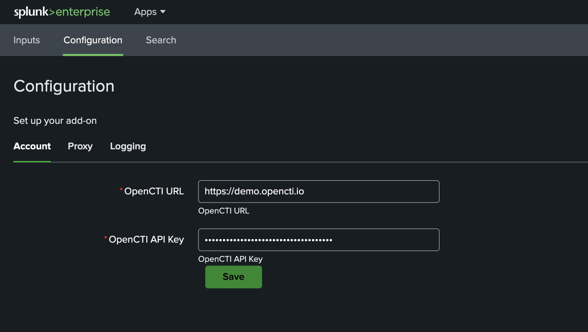
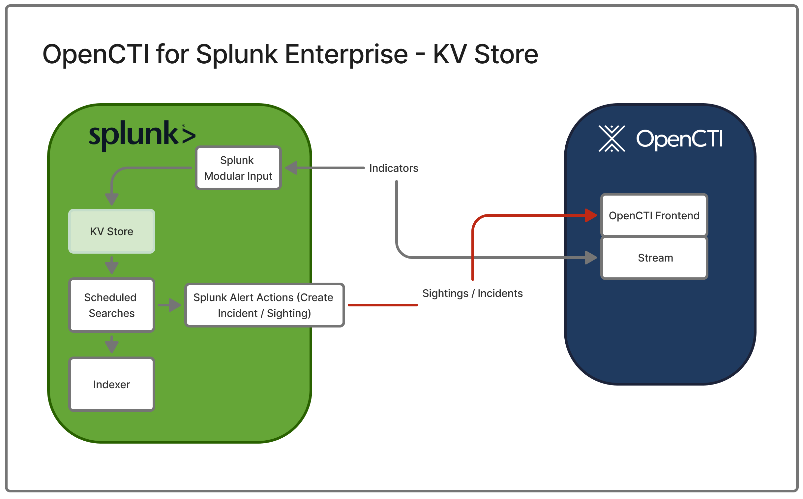
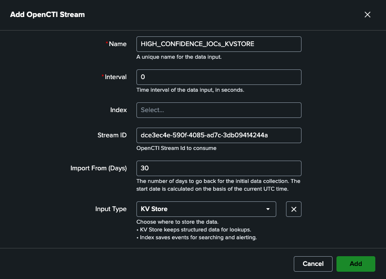
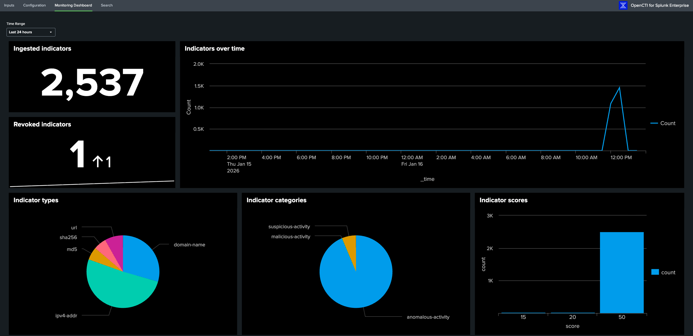
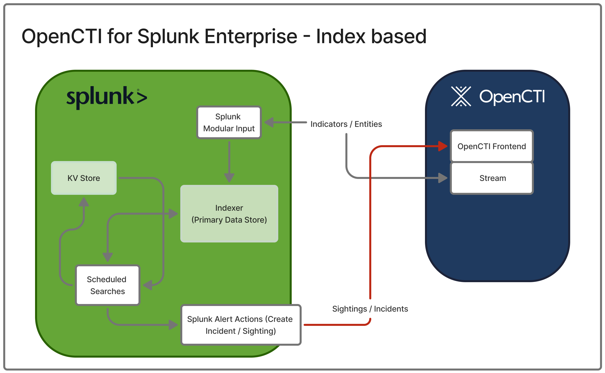
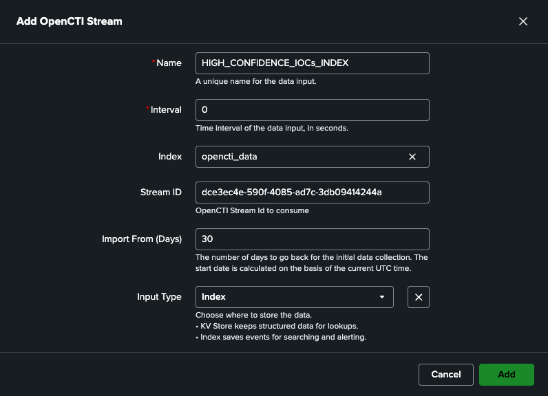
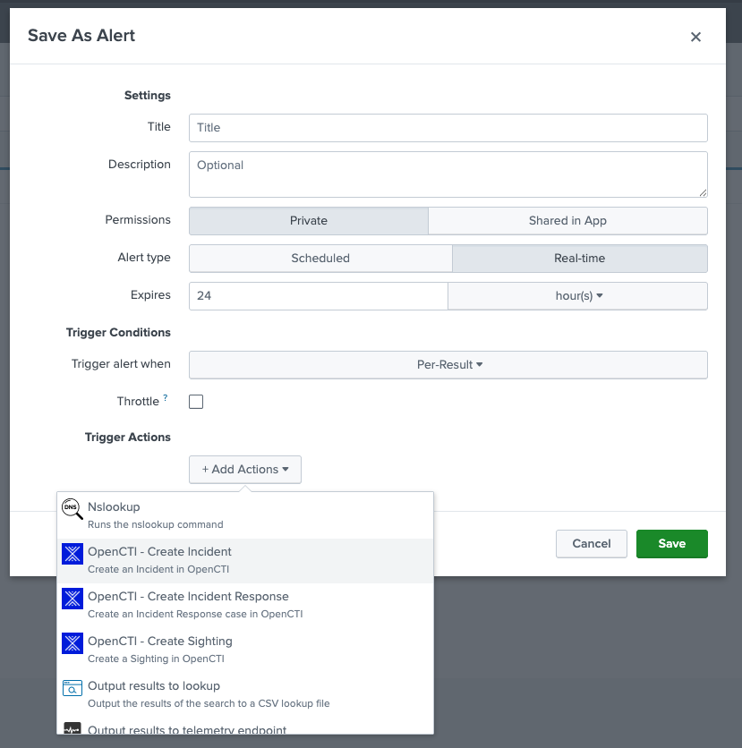
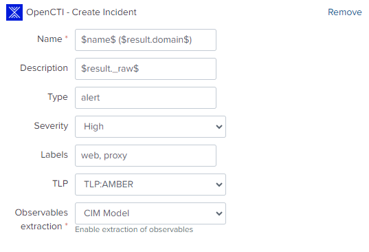

# OpenCTI for Splunk Enterprise

Version 1.2.0  
Author: Filigran  
Package: TA-opencti-for-splunk-enterprise


## Overview

The **OpenCTI for Splunk Enterprise Add-on** provides a modular framework for integrating threat intelligence from [OpenCTI](https://filigran.io/platforms/opencti/) into Splunk.  
It enables analysts to collect, normalize, and enrich OpenCTI indicators and observables, making them searchable within Splunk Enterprise for correlation, detection, and incident response.


## Key Features

- Modular inputs for ingesting OpenCTI data via the OpenCTI Stream API.
- Ability to trigger OpenCTI actions in response of Alerts and to investigate them directly in OpenCTI
- Support for multiple object types (Indicators, Observables, Relationships, Sightings).
- "Splunk proves what OpenCTI disseminates" (1.2.0): Splunk is a named Security Platform in OpenCTI;
  the add-on writes back which indicators are deployed, how often they hit, whether the OpenAEV benign
  tests of IOC validation requests were detected, which telemetry Splunk holds (defense matrix), and the
  evidence of hunts. See [OpenCTI program compatibility](#opencti-program-compatibility).
- Indicators carry provenance (corroboration) and Threat Pulse (community prevalence) fields.
- Every program feature is detected from the OpenCTI schema: on OpenCTI releases without it the add-on
  behaves as before and logs why the feature is skipped.

---

## Installation

### Installation from Splunkbase

1. Log in to the Splunk Web UI and navigate to "Apps" and click on "Find more Apps"
2. Search for "OpenCTI for Splunk Enterprise Add-on"
3. Click Install
   The app is installed

### Installing from file through the UI

1. Download latest version of the Splunk App: [TA-opencti-for-splunk-enterprise-1.2.0.tar.gz](https://github.com/OpenCTI-Platform/splunk-enterprise-add-on/releases/download/1.2.0/TA-opencti-for-splunk-enterprise-1.2.0.tar.gz)
2. Log in to the Splunk Web UI and navigate to "Apps" and click on "Manage Apps"
3. Click "Install app from file"
4. Choose file and select the "TA-opencti-for-splunk-enterprise-1.2.0.tar.gz" file
5. Click on Upload
   The app is installed

---

## General Configuration

### OpenCTI user account

Before configuring the App, we strongly recommend that you create a dedicated account in OpenCTI with the same properties as for a connector service account.
To create this service account, please refer to [Create a Service Account](https://docs.opencti.io/latest/administration/users/?h=service+account#create-a-service-account) documentation.

### General Add-On settings

1. Navigate to Splunk Web UI home page, open the "OpenCTI for Splunk Enterprise Add-on" and navigate to "Configuration" page.
2. Click on "Account" tab and complete the form with the required settings:

| Parameter                  | Description                                                      |
|----------------------------|------------------------------------------------------------------|
| `OpenCTI URL`              | The URL of the OpenCTI platform (A HTTPS connection is required) |
| `OpenCTI API Key`          | The API Token of the previously created user                     |



Configuration parameters are stored securely in `local/passwords.conf`.  
Never ship credentials in `default/passwords.conf`.

If a proxy configuration is required to connect to OpenCTI platform, you can configure it on the Proxy page

| Parameter        | Description                                                                 |
|------------------|-----------------------------------------------------------------------------|
| `Enable Proxy`   | Determines whether a proxy is required to communicate with OpenCTI platform |
| `Proxy Type`     | The type of proxy to use                                                    |
| `Proxy Host`     | The proxy hostname or IP address                                            |
| `Proxy Port`     | The proxy port                                                              |
| `Proxy Username` | An optional proxy username                                                  |
| `Proxy Password` | An optional proxy password                                                  |

### Security Platform settings

From 1.2.0, the add-on identifies this Splunk deployment in OpenCTI as a **Security Platform** of type
SIEM. Deployments, hits, IOC validation proofs, sightings, hunt evidence and telemetry are attached to it.
Configure it on the "Security Platform" tab of the Configuration page:

| Parameter                                | Description                                                                                                                                  | Default            |
|------------------------------------------|----------------------------------------------------------------------------------------------------------------------------------------------|--------------------|
| `Security Platform ID`                   | Id (internal or STIX) of an existing OpenCTI Security Platform. Takes precedence over the name                                               | empty              |
| `Create the Security Platform`           | When no id is set, find the Security Platform by name, or create it (type SIEM)                                                               | enabled            |
| `Security Platform name`                 | Name used to find or create it. Use the same name as the `platform_name` of the OpenCTI `splunk-saved-searches` connector (see below)        | `Splunk <server>`  |
| `Deployment write-back`                  | Report the deployment status of every indicator ingested by the modular input                                                                | enabled            |
| `Write-back batch size`                  | Deployment reports per OpenCTI call (1-500)                                                                                                   | 100                |
| `Write-back rate limit`                  | Maximum write-back calls per minute (1-6000)                                                                                                  | 60                 |
| `IOC validation write-back`              | Write the outcomes decided by the "OpenCTI - IOC validation proof" search back to OpenCTI                                                     | enabled            |
| `IOC validation grace period (minutes)`  | Delay after the end of a validation test before a missing hit is reported as missed                                                           | 30                 |
| `Feature detection cache (minutes)`      | How long the capabilities read from the OpenCTI GraphQL schema are cached                                                                     | 60                 |

The resolved Security Platform is cached in the KV Store (`opencti_addon_state`) and shared by every
search head of a cluster, so members with different server names keep one Security Platform.

**OpenCTI account permissions.** The account of the add-on needs the capabilities of a connector service
account (bundle push and connector registration) plus "Knowledge: create / update" for the write-back
mutations and the Security Platform creation; Run Case Autopilot also needs "Knowledge: ask for
enrichment" and an Enterprise Edition license.

## OpenCTI Data Inputs Configuration

The "OpenCTI for Splunk Enterprise Add-on" enables Splunk to be feed with intelligence exposed through an OpenCTI live stream. 
To do this, the add-on implements and manages Splunk modular inputs.

When configuring a modular input, you have two options for storing intelligence data:
- Write directly to dedicated KV Store collections defined by the application
- Write to a Splunk index, which will then propagate the data to a KV Store using saved searches


### KV Store Ingestion Configuration

The KV Store data input type mode allows pre-defined KV Store to be directly fed with intelligence exposed by the OpenCTI live stream.



Proceed as follows to enable the ingestion of data in pre-defined KV Store:

1. From the "OpenCTI for Splunk Enterprise Add-on" sub menus, select the "Inputs" sub menu.
2. Click on "Create new input" button.
3. Complete the form with the following settings:

| Parameter     | Description                                                                                                    |
|---------------|----------------------------------------------------------------------------------------------------------------|
| `Name`        | Unique name for the input being configured                                                                     |
| `Interval`    | Time interval of input in seconds. Leave as default (0) to allow continuous execution of the ingestion process |
| `Index`       | Leave empty. Not applicable when writing directly to KV Store                                                  |
| `Stream Id`   | The Live Stream ID of the OpenCTI stream to consume                                                            |
| `Import from` | The number of days to go back for the initial data collection (default: 30) (optional)                         |
| `Input Type`  | Select KV Store entry                                                                                          |

4. Once the Input parameters have been correctly configured click "Add".



5. Validate the newly created Input and ensure it's set to "Enabled".

As soon as the input is created, the ingestion of data begins.

Here are the KV Store names used to store intelligence: 
- opencti_indicators: store STIX indicators and related context information (related threat actors, vulnerabilities, malware, attack patterns...)
- opencti_reports: store STIX reports
- opencti_markings: store STIX markings definitions
- opencti_identities: store STIX identities definitions

You can monitor the import of indicators using the following Splunk SPL query that list all indicators ingested in the 'opencti_indicators' KV Store:

```
| inputlookup opencti_indicators
```

You can also consult the "Monitoring Dashboard" which gives you an overview of indicators ingested in the 'opencti_indicators' KV Store.



The ingestion process can also be monitored by consulting the log file ```ta-opencti-for-splunk-enterprise_{DATA_INPUT_NAME}.log``` present in the directory ```$SPLUNK_HOME/var/log/splunk/```

---
### Index-Based Ingestion Configuration (Required for Saved Searches)

When using **Index mode** ingestion, OpenCTI data is first written to a Splunk index and then synchronized into KV Store collections via saved searches.  


This section explains **how to define the index**, **configure macros**, and **enable the required saved searches**.


#### 1. Choose or Create a Splunk Index

By default, the add-on **does not assume a fixed Index name**.

#### Recommended default index
```
opencti_data
```
#### Create a dedicated index (recommended)

In Splunk Web:

1. Go to **Settings ▸ Indexes**
2. Click **New Index**
3. Set:
   - **Index name:** `opencti_data`
   - Leave other settings at defaults (or align with your data retention policy)
4. Save

> ⚠️ If you choose a **custom index name**, you must update the OpenCTI macro configuration (see below).

---

#### 2. Configure the OpenCTI Modular Input (Index Mode)

1. From the "OpenCTI for Splunk Enterprise" Add-on sub menus, select the "Inputs" sub menu.
2. Click on "Create new input" button.
3. Complete the form with the following settings:

| Parameter     | Description                                                                                                    |
|---------------|----------------------------------------------------------------------------------------------------------------|
| `Name`        | Unique name for the input being configured                                                                     |
| `Interval`    | Time interval of input in seconds. Leave as default (0) to allow continuous execution of the ingestion process |
| `Index`       | `opencti_data` (or your custom index)                                                                          |
| `Stream Id`   | The Live Stream ID of the OpenCTI stream to consume                                                            |
| `Import from` | The number of days to go back for the initial data collection (default: 30) (optional)                         |
| `Input Type`  | Select `Index entry`                                                                                           |



4. Once the Input parameters have been correctly configured click "Add".

Once enabled:
- Each **OpenCTI stream event** is written as a **Splunk event**
- Events are **append-only**
- The same indicator may appear multiple times as it evolves over time

#### Event metadata

| Field        | Value                                       |
|--------------|---------------------------------------------|
| `source`     | `opencti`                                   |
| `sourcetype` | `opencti:indicator`, `opencti:report`, etc. |

---

#### 3. Configure the OpenCTI Index Macro (Required)

All shipped saved searches rely on a macro to locate OpenCTI data.

#### Macro name

```
opencti_index
```

#### Default definition

```
index=opencti_data
```

#### How to configure

1. Go to **Settings ▸ Advanced Search ▸ Search macros**
2. Locate `opencti_index`
3. Edit the macro definition:
```
index=<YOUR_INDEX_NAME>
```
4. Save

> ⚠️ If this macro is not updated correctly:
> - Saved searches will return **zero results**
> - KV Store synchronization will silently fail

---

#### 4. Enable Required Saved Searches (Index → KV Store Sync)

Index mode relies on scheduled searches to populate KV Store collections.

#### Required saved searches

| Saved Search Name                           | Purpose                                            |
|---------------------------------------------|----------------------------------------------------|
| `Update OpenCTI Indicators Lookup`          | Sync indicators into `opencti_indicators` KV Store |
| `Update OpenCTI Reports Lookup`             | Sync reports into `opencti_reports`                |
| `Nightly Rebuild OpenCTI Indicators Lookup` | Full rebuild safety net                            |

#### Enable them

1. Go to **Settings ▸ Searches, reports, and alerts**
2. Set **App context** to `TA-opencti-for-splunk-enterprise`
3. Enable:
- `Update OpenCTI Indicators Lookup`
- `Update OpenCTI Reports Lookup`
4. Verify schedules are enabled (default is sufficient)

---

#### 5. Data Flow Summary (Index Mode)
```
OpenCTI Stream
↓
Splunk Index (opencti_data)
↓
Saved Searches
↓
KV Store Collections
↓
Dashboards / Alert Actions
```
---

#### 6. Common Failure Modes (and How to Avoid Them)

| Issue                       | Cause                       | Fix                    |
|-----------------------------|-----------------------------|------------------------|
| No indicators in dashboards | Macro points to wrong index | Update `opencti_index` |
| KV Stores empty             | Saved searches disabled     | Enable saved searches  |
| Duplicate indicators        | Expected behavior           | Events are versioned   |

---

#### 7. Verification Checklist

Run these searches to confirm everything is working:

#### Index ingestion
```
`opencti_index`
| stats count by sourcetype
```

#### KV Store population

```
| inputlookup opencti_indicators
| head 10
```

## OpenCTI custom alert actions

You can use the "OpenCTI for Splunk Enterprise" to create custom alert actions that automatically create 'incidents' or/and 'incident response cases' or/and 'sighting' in response to alert trigger by Splunk.

### Create an incident or/and an incident response case or/and a sighting in OpenCTI

You can create an incident or an incident response case in OpenCTI from a custom alert action.
1. Write a Splunk search query.
2. Click Save As > Alert.
3. Fill out the Splunk Alert form. Give your alert a unique name and indicate whether the alert is a real-time alert or a scheduled alert.
4. Under Trigger Actions, click Add Actions.
5. From the list, select "OpenCTI - Create Incident" if you want the alert to create an incident in OpenCTI or "OpenCTI - Create Incident Response" if you want to create an incident response case in OpenCTI or "OpenCTI - Create Sighting" if you want to create a sighting in OpenCTI.



6. To create and incident or an incident response case, complete the form with the following settings:

| Parameter                | Description                                           | Scope                             |
|--------------------------|-------------------------------------------------------|-----------------------------------|
| `Name`                   | Name of the incident                                  | Incident & Incident response case |
| `Description`            | Description of the incident or incident response case | Incident & Incident response case |                              
| `Type`                   | Incident Type or incident response case type          | Incident & Incident response case |                              
| `Severity`               | Severity of the incident or incident response case    | Incident & Incident response case | 
| `Priority`               | Priority of the incident response case                | Incident response case            | 
| `Labels`                 | Labels (separated by a comma) to be applied           | Incident & Incident response case | 
| `TLP`                    | Markings to be applied                                | Incident & Incident response case | 
| `Observables extraction` | Method for extracting observables                     | Incident & Incident response case | 
| `Incident key`           | Optional result field names, comma-separated, read on every result (for example `event_id` for an ES notable, or `user,src` for a `stats ... by user src` search). Distinct values always create distinct objects, the same values upsert. Use field names, not `$result.<field>$` tokens: Splunk resolves those against the first result only | Incident & Incident response case |
| `Add a timeline milestone` | Adds the alert (name, trigger time, link to the Splunk results) as a milestone of the timeline of the created object (OpenCTI with incident and case timelines) | Incident & Incident response case |
| `Run Case Autopilot`     | Runs Case Autopilot once per created object (OpenCTI Enterprise Edition with Case Autopilot). The run is recorded in the add-on state KV Store collection; when that collection is unavailable the run is skipped rather than repeated | Incident & Incident response case |
| `Case Autopilot policy ID` | Optional investigation policy, the platform default applies when empty | Incident & Incident response case |

Incidents and cases created from indexed events (results carrying `_cd` / `_raw`) get an id derived from
the event itself, so distinct events firing in the same second never merge (#47), while the same event
returned by overlapping scheduled runs keeps upserting onto one object. Rows of transforming searches
(`stats`, `table`...) should name their split-by fields in `Incident key`. Without it they keep the
historical name + time id; when several of them share that id in one run, the second and following rows
get distinct ids in row order, which only stays stable while the row order does (the action logs a
warning when this happens).

> Upgrading from 1.1.x: indexed events get new ids in 1.2.0. An event already sent by 1.1.x and returned
> again by an overlapping scheduled run just after the upgrade creates a second object, once.

The timeline milestone (lane `custom`) and Run Case Autopilot happen once OpenCTI has ingested the created object
(the bundle is processed asynchronously by the OpenCTI workers, the action waits up to 60 seconds); both
are idempotent, so a skipped milestone is added by the next run of the alert.

7. To create a sighting, complete the form with the following settings:

| Parameter                | Description                                                   | Scope      |
|--------------------------|---------------------------------------------------------------|------------|
| `Sighting Of (value)`    | Value of what was sighted                                     | Sighting   |
| `Sighting Of (type)`     | Type of what was sighted: an Indicator (`Indicator ID`, or `URL`, `Domain`, `IPV4`, `IPV6`, `File Hash`, `Email Address` Indicator, default `Domain Indicator`); the legacy `<type> Observable` types sight the matching Indicator | Sighting   |
| `Count`                  | Number of times the value was seen (for example `$result.count$`), default 1 | Sighting   |
| `Where Sighted (value)`  | Optional 'System' or 'Organization' that saw the sighting, in addition to the Splunk Security Platform | Sighting   |                              
| `Where Sighted (type)`   | 'System' or 'Organization' that saw the sighting              | Sighting   | 
| `Sighted on the Splunk Security Platform` | Adds the Splunk Security Platform (Configuration > Security Platform) to where the value was sighted (default) | Sighting |
| `Labels`                 | Labels (separated by a comma) to be applied                   | Sighting   | 
| `TLP`                    | Markings to be applied                                        | Sighting   | 

**Sightings of indicators (#57, #67).** STIX 2.1 sightings reference an Indicator: OpenCTI rules such as
"Raise incident based on sighting" and the sighting propagation only apply to them.
- `Indicator ID`: pass the STIX id of an indicator imported by the add-on, for example
  `... | lookup opencti_indicators value AS dest OUTPUT id AS indicator_id | where isnotnull(indicator_id)` and
  `Sighting of Value = $result.indicator_id$`. The sighting references this indicator directly.
- `<type> Indicator`: pass a raw value. The add-on looks for the indicator in `opencti_indicators`, then in
  OpenCTI by its exact STIX pattern, and otherwise creates the indicator from this single value (for
  example `[domain-name:value = 'example.com']`), with the id OpenCTI gives this pattern.
- `<type> Observable` types are kept for existing alerts only (the default is now `Domain Indicator`).
  Current OpenCTI rejects a sighting of an observable, so such an alert sights the matching
  `<type> Indicator`, resolved the same way. The observable is still sent, linked to that
  indicator by a `based-on` relationship.

The sighting `first_seen` / `last_seen` come from the `first_seen` / `last_seen` fields of the result when
present (epoch or ISO 8601, for example from `stats min(_time) AS first_seen max(_time) AS last_seen`),
otherwise from `_time`.

You can use [Splunk "tokens"](https://docs.splunk.com/Documentation/Splunk/9.2.2/Alert/EmailNotificationTokens#Result_tokens) as variables in the form to contextualize the data imported into OpenCTI.
Tokens represent data that a search generates. They work as placeholders or variables for data values that populate when the search completes.

Example of a configuration to create an incident in OpenCTI



### Observables extraction

To extract and model alert fields as OpenCTI observables attached to the incident or incident response case, the Add-on purpose two methods describe below.

#### CIM model

The “CIM model” method is based on the definition of CIM model fields. With this method, the Add-on will extract all the following fields and model them as follows:

| CIM Field         | Observable type                     |
|-------------------|-------------------------------------|
| `url`             | URL observable                      | 
| `url_domain`      | Domain observable                   |                       
| `user`            | User account observable             |                            
| `user_name`       | User account observable             | 
| `user_agent`      | User agent Observable               |
| `http_user_agent` | User agent Observable               |
| `dest`            | IPv4 or IPv6 or Hostname observable |
| `dest_ip`         | IPv4 or IPv6 observable             |
| `src`             | IPv4 or IPv6 or Hostname observable |
| `src_ip`          | IPv4 or IPv6 observable             |
| `file_hash`       | File observable                     |
| `file_name`       | File observable                     |


#### Field mapping

The “Field mapping” method searches for event fields starting with the string “octi_” and ending with an observable type.
The following list describe list of supported fields:

| OCTI Field                         | Observable type                       |
|------------------------------------|---------------------------------------|
| `octi_ip`                          | IPv4 or IPv6 observable               | 
| `octi_url`                         | URL observable                        |
| `octi_domain`                      | Domain observable                     |                       
| `octi_hash`                        | File observable                       |                       
| `octi_email_addr`                  | Email address observable              |                       
| `octi_user_agent`                  | User agent observable                 |                       
| `octi_mutex`                       | Mutex observable                      |                       
| `octi_text`                        | Text observable                       |                       
| `octi_windows_registry_key`        | Windows Registry Key observable       |                       
| `octi_windows_registry_value_type` | Windows Registry Key Value observable |                       
| `octi_directory`                   | Directory observable                  |                       
| `octi_email_message`               | Email message observable              |    
| `octi_file_name`                   | File observable                       |    
| `octi_mac_addr`                    | MAC address observable                | 
| `octi_user_account`                | User account address observable       |    

You can use the Splunk ```eval``` command to create a new field based on the value of another field.

Example:

```sourcetype=* | lookup opencti_indicators value as url_domain OUTPUT id as match_ioc_id | search match_ioc_id=* | eval octi_domain=url_domain | eval octi_url=url ```


Logs related to OpenCTI custom alerts are available in the following log files:

```$SPLUNK_HOME/var/log/splunk/opencti_create_incident_modalert.log```

```$SPLUNK_HOME/var/log/splunk/opencti_create_incident_response_modalert.log```

```$SPLUNK_HOME/var/log/splunk/opencti_create_sighting_modalert.log```

```$SPLUNK_HOME/var/log/splunk/opencti_report_hunt_evidence_modalert.log```

An alert action exits with a non-zero code when at least one result could not be sent (#18), so failures
show in the Splunk alert action status (`index=_internal sourcetype=splunkd component=sendmodalert`).

---

## OpenCTI program compatibility

The add-on speaks natively the OpenCTI autonomous threat management program: an indicator is not just
disseminated, it is deployed on a named Splunk Security Platform, its hits are counted, OpenAEV benign
tests prove the detection, hunts report evidence, the shipped detections and the Splunk telemetry feed the
defense matrix, and every indicator carries corroboration and community prevalence.

### Compatibility matrix

The add-on reads the OpenCTI GraphQL schema once per platform (cached in the KV Store, see
`Feature detection cache`) and enables each capability only where the platform provides it. Missing
capabilities are skipped with one log line such as
`Timeline milestone: skipped, the OpenCTI platform (6.9.0) does not provide the incident and case timeline`.

| Add-on capability                                            | OpenCTI capability (detected)                                    | OpenCTI releases without it          |
|--------------------------------------------------------------|------------------------------------------------------------------|--------------------------------------|
| Ingestion, enrichment, Create Incident / Case / Sighting     | live streams, `stixBundlePush`                                   | always available                     |
| Splunk Security Platform (configured or auto-created)        | `securityPlatformAdd`, `securityPlatforms`                       | sightings use the selected System / Organization only |
| Deployment write-back, reconciliation                        | `indicatorReportDeployment(s)`, `deployed-on`                    | skipped                              |
| Indicator hits                                               | `indicatorReportHits`                                            | reported as sightings on the Security Platform |
| IOC validation proof                                         | `iocValidationRequests` (+ `iocValidationReportResults`)         | skipped (bundle write-back without the results mutation) |
| Telemetry inventory (`provides`)                             | `provides` relationship (Security Platform -> Data Component)    | skipped                              |
| Hunt evidence linked to the run                              | `huntRun` (+ `huntRunEvidenceAdd`)                               | evidence sent without the run link   |
| Timeline milestone                                           | `timelineEventAdd`                                               | skipped                              |
| Run Case Autopilot                                           | `investigationRunAdd` and an Enterprise Edition license          | skipped                              |
| Provenance fields                                            | provenance stream extension, `Indicator.corroboration_count`     | fields absent                        |
| Threat Pulse fields                                          | `Indicator.pulse`                                                | fields absent                        |

| Add-on version | OpenCTI version | Program features                                                                                 |
|----------------|-----------------|--------------------------------------------------------------------------------------------------|
| 1.1.x          | 6.x and later   | none                                                                                             |
| 1.2.0          | 6.x and later   | Security Platform sightings where the entity exists; every other feature disabled and logged     |
| 1.2.0          | program releases | every capability the platform provides, detected at runtime (no configuration per version)     |

Innovations without a Splunk surface (source intelligence, autonomous curation, graph analytics, time
machine) need nothing here: the hits and sightings reported by the add-on feed the source impact
metrics of OpenCTI.

### Dissemination assurance: deployments, hits and IOC validation proof

#### Deployment write-back

When `Deployment write-back` is enabled, the modular input reports to OpenCTI the deployment state of every
indicator it writes, on the Splunk Security Platform:

| Splunk event                                                   | Reported status | External id                                |
|----------------------------------------------------------------|-----------------|--------------------------------------------|
| Indicator written to `opencti_indicators` (KV Store mode)       | `deployed`      | `kvstore:opencti_indicators/<_key>`         |
| Indicator event written to the index (index mode)              | `deployed`      | `index:<index>/<indicator STIX id>`         |
| Delete event, or update of a revoked indicator                 | `removed` (index mode also deletes the `opencti_indicators` entry, keyed by the STIX id by the lookup searches) | same |
| Same, with `valid_until` in the past                            | `expired` (reported as `removed` with `removed_at = valid_until` when the platform reserves `expired`) | same |
| KV Store or index write failure                                | `failed` with the error message | same                         |
| Drift repaired by `openctireconcile`                           | `deployed`, `removed` or `expired` | the external id OpenCTI holds, else `kvstore:opencti_indicators/<_key>` (the reconciliation reads the KV Store) |

Reports are queued, deduplicated per indicator (the last state wins), sent in batches of
`Write-back batch size` under the `Write-back rate limit`, and retried with a backoff (15 s, 60 s) before
being abandoned and logged; OpenCTI applies them idempotently. The last report per indicator is kept in
the `opencti_deployments` collection (Monitoring dashboard).

#### Reconciliation

The `OpenCTI - Reconcile indicator deployments` saved search (`| openctireconcile`, hourly) compares
`opencti_indicators` with the `deployed-on` relationships OpenCTI knows for the Splunk Security Platform
and repairs the drift (indicators deployed in Splunk but unknown or not live in OpenCTI, live in OpenCTI
but absent, revoked or expired in Splunk). `| openctireconcile refresh=true` also re-reports indicators
already in sync, which refreshes `last_sync_at` in OpenCTI. In index mode, enable the KV Store sync
searches first: the reconciliation reads the KV Store. A repaired deployment keeps the external id OpenCTI
already holds for it (KV Store or index), so the stream input and the reconciliation never overwrite each other.

#### Indicator hits

`OpenCTI - Report indicator hits` (every 15 minutes, over the snapped window `-20m@m` to `-5m@m`, so the
windows never overlap and late events are indexed) matches the indicators against the CIM data models
(`Network_Traffic` source and destination IPs, `Network_Resolution` DNS queries, `Web` URLs,
`Endpoint.Filesystem` and `Endpoint.Processes` hashes, `Email` senders) and pipes one row per indicator
into `| openctireporthits`, which calls `indicatorReportHits` (hit counter of the `deployed-on`
relationship and stable hits sighting Indicator -> Security Platform). On platforms without it, a sighting
on the Security Platform is created instead. Each indicator is reported once per window; replays are
ignored, by the add-on and by OpenCTI.

Configure the scope with the `opencti_hits_scope` macro (tstats `where` clause, for example
`index=proxy OR index=firewall`) and set `opencti_hits_summariesonly` to `summariesonly=true` when the data
models are accelerated. Remove an `append` branch of the search to skip a data model. Results also carry
`opencti_hit_status` (`reported`, `reported_as_sighting`, `duplicate`, `invalid`, `error`,
`skipped_no_platform`) and the history is kept in `opencti_indicator_hits`.

#### IOC validation proof

OpenCTI asks OpenAEV to run benign tests built from deployed indicators (IOC validation requests).
`OpenCTI - IOC validation proof` (`| openctivalidation`, every 15 minutes) lists the requests that target
the Splunk Security Platform and, for each indicator of the request still waiting for a result on this
platform:

- **detected** when a hit window of the indicator overlaps the test window (dispatch to completion of the
  request, plus the grace period), or when the last hit OpenCTI recorded on the deployment does;
- **missed** when the request is completed, the grace period is over and no hit overlaps; a sighting
  with `x_opencti_negative = true` records the miss on the Security Platform;
- **requested** otherwise: no result yet, nothing is written. This includes a later hit recorded by
  OpenCTI that the local hit history does not hold (lost KV Store write), and a history whose oldest
  windows (beyond the last 50) were trimmed after the test started: a miss is never declared on an
  incomplete history.

Outcomes are written once per request and indicator (`opencti_validation_results`): through
`iocValidationReportResults` when the platform has it, otherwise through a STIX bundle carrying the
`deployed-on` relationship with `validation_status`, `validation_run_id` and `last_validation_at`. Pairs
already resolved by OpenAEV (detected / prevented) are never overwritten. `| openctivalidation
writeback=false` shows the outcomes without writing them.

#### End-to-end proof: OpenAEV benign test -> Splunk event -> hit -> OpenCTI validation status

1. Enable the add-on ingestion (KV Store mode or index mode with the sync searches) and the
   `OpenCTI - Report indicator hits` and `OpenCTI - IOC validation proof` searches.
2. In OpenCTI, request the validation of indicators deployed on the Splunk Security Platform (the
   indicators show the platform in their Deployment tab, written by the add-on). OpenAEV builds a benign
   test per indicator, for example a DNS resolution of a domain indicator from an agent whose DNS logs
   reach Splunk.
3. The test produces a Splunk event, normalized by your technology add-on into the CIM data model
   (`Network_Resolution` for the DNS query).
4. The next run of `OpenCTI - Report indicator hits` matches the event against `opencti_indicators`,
   reports the hit to OpenCTI (hit counter, sighting, deployment status `active`) and records the hit
   window in `opencti_indicator_hits`.
5. `OpenCTI - IOC validation proof` sees the hit inside the test window and writes `detected` for this
   indicator and the Splunk Security Platform. Without a hit, once the request is completed and the grace
   period is over, it writes `missed` and a negative sighting.
6. OpenCTI shows the validation status on the `deployed-on` relationship, in the Security Platform
   Deployments tab and in the dissemination assurance dashboard. In Splunk, the "Dissemination assurance"
   tab of the Monitoring dashboard lists the proofs.

### Detection searches and the defense matrix

#### ATT&CK-annotated detections

The add-on ships detections matching the OpenCTI indicators against CIM data, disabled by default:

| Saved search                                            | Data                                        | MITRE ATT&CK                     |
|---------------------------------------------------------|---------------------------------------------|----------------------------------|
| `OpenCTI - Network traffic with an indicator IP`        | `Network_Traffic` source / destination IP   | T1071, T1095, T1571              |
| `OpenCTI - DNS resolution of an indicator domain`       | `Network_Resolution` DNS query              | T1071.004, T1568                 |
| `OpenCTI - Web request to an indicator URL`             | `Web` URL                                   | T1071.001, T1189, T1566.002      |
| `OpenCTI - File or process matching an indicator hash`  | `Endpoint` file and process hashes          | T1204.002, T1105                 |
| `OpenCTI - Email from an indicator sender`              | `Email` sender                              | T1566.001, T1566.002             |

Each one is a scheduled alert (tracked, throttled per indicator for one hour) whose rows carry
`indicator_id`, `value`, `count`, `first_seen` and `last_seen`: attach "OpenCTI - Create Sighting" with
`Sighting Of (type) = Indicator ID`, `Sighting Of (value) = $result.indicator_id$` and
`Count = $result.count$` to sight the indicator on the Splunk Security Platform. The techniques are
declared in `action.correlationsearch.annotations` (`{"mitre_attack": [...]}`), the convention read by
Splunk Enterprise Security and by the OpenCTI `splunk-saved-searches` connector, which imports them as
detection rules indicating the techniques and deployed on the Splunk Security Platform. Maintenance
searches (KV Store sync, hits, validation, reconciliation, inventory) declare no technique and trigger no
alert action, so the connector does not import them with its default `alerts` scope.

To make the connector and the add-on target the same Security Platform, set the connector
`platform_name` to the add-on Security Platform name (both derive the same identity from the name).

#### Telemetry inventory (provides)

`OpenCTI - Telemetry inventory` (daily, over 7 days) lists the CIM data models (`tstats`) and the
sourcetypes (`metadata`) holding data, maps them to MITRE Data Components through the
`opencti_cim_data_components` lookup and pipes one row per data component into `| openctiprovides`, which
declares `provides` relationships Splunk Security Platform -> Data Component in OpenCTI. The defense
matrix then knows which techniques Splunk has telemetry for.

The lookup (`lookups/opencti_cim_data_components.csv`) is editable: one row per `source`
(`datamodel:<Model>[.<Dataset>]` or `sourcetype:<sourcetype>`, wildcards allowed) and `data_component`
(the MITRE Data Component name, as imported in OpenCTI). Data components unknown to OpenCTI are reported
with the status `unmatched_data_component`. `| openctiprovides prune=true` also deletes the provides
relationships the add-on declared earlier for data components absent from the inventory; nothing is
pruned when the inventory is empty or when a declaration of the run failed. With the
default `opencti_inventory_summariesonly` (`summariesonly=true`), only accelerated data models count.

### Hunts

#### Report hunt evidence

The "OpenCTI - Report hunt evidence" alert action reports the results of a hunt search as evidence of
an OpenCTI hunt run:

| Parameter                | Description                                                                 |
|--------------------------|-----------------------------------------------------------------------------|
| `Hunt run ID`            | Id of the OpenCTI hunt run, usually a field of the results (`$result.hunt_run_id$`) |
| `Count`                  | Number of matching events of the result (`$result.count$`)                  |
| `Observables Extraction` | `CIM Model` (default) or `Field Mapping`, as for the incident actions        |
| `Labels`, `TLP`          | Labels and marking of the evidence                                          |

For each result, the action creates an Observed-Data over the extracted observables (`number_observed` =
count) and a sighting of each target of the hunt (indicators, attack patterns, threats) on the Splunk
Security Platform; every object carries `x_opencti_hunt_run_id` and names the run in its description.
Ids are deterministic per run, objects and observation window, so a re-sent result updates its
evidence while a later observation of the same objects adds new evidence.
When the platform supports it, the objects are attached to the hunt run (`huntRunEvidenceAdd`).

Example hunt search, run with the id of the hunt run OpenCTI created:

```
| tstats count min(_time) AS first_seen max(_time) AS last_seen from datamodel=Network_Resolution.DNS
    where `opencti_hunt_scope` DNS.query="*.example-c2.top" by DNS.query DNS.src
| rename DNS.query AS query DNS.src AS src
| eval hunt_run_id="<hunt run id>"
```

#### OpenCTI internal-hunt/splunk connector

The OpenCTI hunt connector for Splunk translates the Sigma logic of hunts into SPL with pySigma and runs
it through the Splunk REST search API. Recommendations:

- **Service account**: a dedicated Splunk user for the connector, with a role allowing `search` and
  `rest_properties_get` only, searchable indexes restricted to the hunt scope, a search quota
  (`srchJobsQuota`, `srchDiskQuota`) and a time window limit (`srchTimeWin`). Use a Splunk token, not a
  password.
- **Scope**: set the role default and allowed indexes to the same indexes as the `opencti_hunt_scope`
  macro, and use the macro in hunt searches written by hand, so a hunt never reads more than intended.
- **REST endpoint**: `https://<search head>:8089/services/search/v2/jobs/export` (or `search/jobs`
  for long runs); the connector needs network access to the management port.
- **pySigma pipelines**: `splunk_windows` for Windows event logs, `splunk_cim_data_model` (or the CIM
  pipeline of your backend version) when your data is CIM-normalized; the CIM field names (`dest`,
  `src`, `user`, `process`, `file_hash`, `query`, `url`...) are those of the Splunk Common Information
  Model.
- **Evidence**: the connector reports the hits of the runs it executes; hunts implemented as Splunk
  saved searches report through the "OpenCTI - Report hunt evidence" alert action above.

### Provenance and Threat Pulse fields

When the platform provides them, `opencti_indicators` (KV Store mode) and the indicator events (index
mode) carry:

| Field                        | Meaning                                                                             |
|------------------------------|-------------------------------------------------------------------------------------|
| `corroboration_count`        | Number of distinct sources asserting the indicator                                  |
| `assertions_count`           | Number of assertions, all sources                                                   |
| `first_asserted_at`, `last_asserted_at` | First and last time a source asserted it                               |
| `single_sourced`             | Only one source asserts it                                                          |
| `has_conflicts`              | Sources disagree on one of its fields                                               |
| `freshness_stale`            | Flagged stale by the OpenCTI knowledge decay rules                                  |
| `sources`, `sources_by_kind` | Names of the sources the account may see, and count per kind (connector, feed...)   |
| `pulse_prevalence`           | Threat Pulse community prevalence (`rare`, `uncommon`, `common`, `widespread`)      |
| `pulse_trend`                | Threat Pulse trend (`rising`, `stable`, `falling`)                                  |
| `pulse_first_seen_network`, `pulse_platforms_bucket` | First seen across the network, contributing platforms bucket |

OpenCTI updates these fields without stream events, so `OpenCTI - Refresh indicator knowledge fields`
(`| openctireconcile mode=knowledge`, daily) refreshes them. Filter macros:

| Macro                                       | Keeps                                                    |
|---------------------------------------------|----------------------------------------------------------|
| `` `opencti_corroborated_indicator(2)` ``   | indicators asserted by at least 2 sources                |
| `` `opencti_multi_sourced_indicator` ``     | indicators with more than one source                     |
| `` `opencti_fresh_indicator` ``             | indicators not flagged stale                             |
| `` `opencti_prevalent_indicator` ``         | indicators common or widespread across the network       |
| `` `opencti_trending_indicator` ``          | indicators with a rising pulse trend                     |

Example: alert only on corroborated indicators, keeping indicators of platforms without provenance:

```
| tstats count from datamodel=Network_Traffic.All_Traffic by All_Traffic.dest_ip
| rename All_Traffic.dest_ip AS value
| lookup opencti_indicators value OUTPUT id AS indicator_id corroboration_count pulse_prevalence revoked
| where isnotnull(indicator_id) AND `opencti_usable_indicator`
    AND (isnull(corroboration_count) OR `opencti_corroborated_indicator(2)`)
```

### Custom search commands

| Command                                                       | Type       | Purpose                                                                 |
|---------------------------------------------------------------|------------|-------------------------------------------------------------------------|
| `openctireporthits [id_field] [count_field] [first_field] [last_field]` | eventing (search head) | Report hits per indicator (defaults `indicator_id`, `hit_count`, `first_hit`, `last_hit`) |
| `openctivalidation [writeback=<bool>]`                         | generating | Decide and write back IOC validation outcomes                            |
| `openctireconcile [mode=deployments\|knowledge] [refresh=<bool>]` | generating | Repair the deployment drift, or refresh the knowledge fields            |
| `openctiprovides [prune=<bool>]`                               | eventing (search head) | Declare telemetry as provides relationships                 |

The commands run on the search head with the OpenCTI account of the add-on, so the user running them
needs the `list_storage_passwords` capability (the shipped scheduled searches run as the app owner).
Their logs are in `$SPLUNK_HOME/var/log/splunk/ta-opencti-for-splunk-enterprise_<command>.log`.

### Monitoring

The Monitoring dashboard has six new tabs, named after the OpenCTI features:

- **Dissemination assurance**: deployments by status, failed deployments and last sync, most hit
  indicators, indicators hit per day, validation statuses and latest validations, write-back errors;
- **Sources**: indicators by number of sources, single-sourced share, freshness, most corroborated indicators;
- **Threat Pulse**: prevalence and trend of the indicators;
- **Defense matrix**: data components declared to OpenCTI (provides) and the telemetry inventory;
- **Hunts**: hunt evidence reported by the "OpenCTI - Report hunt evidence" alert action;
- **Timeline**: timeline milestones added and Case Autopilot runs started by the incident alert actions.

### Program saved searches (all shipped disabled)

| Saved search                                   | Schedule            | Purpose                                  |
|------------------------------------------------|---------------------|------------------------------------------|
| `OpenCTI - Report indicator hits`              | every 15 minutes    | Indicator hits                           |
| `OpenCTI - IOC validation proof`               | every 15 minutes    | IOC validation outcomes                  |
| `OpenCTI - Reconcile indicator deployments`    | hourly              | Deployment drift repair                  |
| `OpenCTI - Refresh indicator knowledge fields` | daily               | Provenance and Threat Pulse refresh      |
| `OpenCTI - Telemetry inventory`                | daily               | Defense matrix telemetry (provides)      |